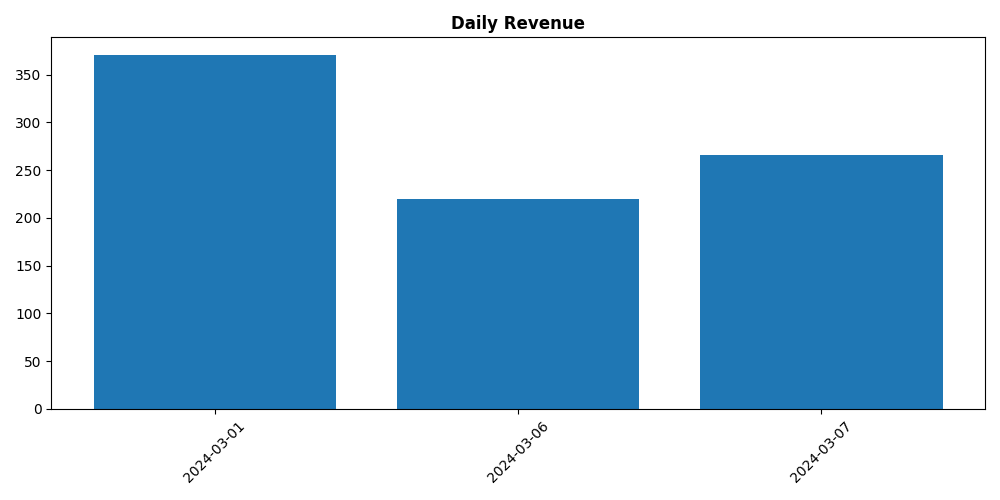
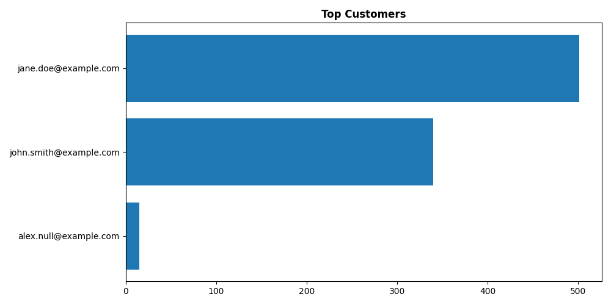
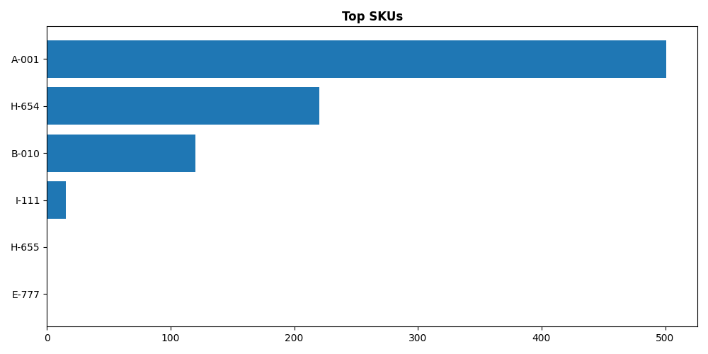

# Orders Pipeline Report

_Generated: 2026-03-01 16:54:59_

## Analytics

### Daily Metrics

| date       |   orders_count |   total_revenue |   average_order_value |
|:-----------|---------------:|----------------:|----------------------:|
| 2024-03-01 |              2 |           370.5 |                185.25 |
| 2024-03-06 |              1 |           220   |                220    |
| 2024-03-07 |              2 |           265.5 |                132.75 |

### Top Customers

|   customer_id | email                  | full_name   |   order_count |   lifetime_spend |
|--------------:|:-----------------------|:------------|--------------:|-----------------:|
|             1 | jane.doe@example.com   | Jane Doe    |             2 |              501 |
|             2 | john.smith@example.com | John Smith  |             2 |              340 |
|             3 | alex.null@example.com  | Alex Null   |             1 |               15 |

### Top SKUs

| sku   |   units_sold |   revenue |
|:------|-------------:|----------:|
| A-001 |            2 |       501 |
| H-654 |            2 |       220 |
| B-010 |            2 |       120 |
| I-111 |            1 |        15 |
| H-655 |            1 |         0 |
| E-777 |            1 |         0 |

---

## Data Quality

### Rejection Summary
| table_name   | reason                |   count |
|:-------------|:----------------------|--------:|
| customers    | Duplicate email       |       1 |
| customers    | Invalid email         |       1 |
| order_items  | Non-positive quantity |       1 |
| order_items  | Unknown order_id      |       5 |
| orders       | Invalid status        |       1 |
| orders       | Unknown customer_id   |       3 |

### Duplicate Emails
| rejected_at                      |   customer_id | email                 | full_name   | signup_date   |
|:---------------------------------|--------------:|:----------------------|:------------|:--------------|
| 2026-03-01 16:54:45.111265+00:00 |             5 | dup.email@example.com | Dupe B      | 2024-02-01    |

### Orphan Orders
| rejected_at                      |   order_id |   customer_id | order_ts                  | status   |   total_amount | currency   |
|:---------------------------------|-----------:|--------------:|:--------------------------|:---------|---------------:|:-----------|
| 2026-03-01 16:54:45.111265+00:00 |       1003 |           999 | 2024-03-02 08:00:00+00:00 | placed   |           75   | ZAR        |
| 2026-03-01 16:54:45.111265+00:00 |       1006 |             5 | 2024-03-05 11:15:00+00:00 | refunded |           48.9 | ZAR        |
| 2026-03-01 16:54:45.111265+00:00 |       1007 |             6 | 2024-03-05 14:00:00+00:00 | shipped  |           10   | ZAR        |

### Invalid Order Items
| rejected_at                      |   order_id |   line_no | sku   |   quantity |   unit_price | category   | reason                |
|:---------------------------------|-----------:|----------:|:------|-----------:|-------------:|:-----------|:----------------------|
| 2026-03-01 16:54:45.111265+00:00 |       1004 |         2 | D-333 |          0 |           45 | Books      | Non-positive quantity |

### Invalid Status
| rejected_at                      |   order_id |   customer_id | order_ts                  | status     |   total_amount | currency   |
|:---------------------------------|-----------:|--------------:|:--------------------------|:-----------|---------------:|:-----------|
| 2026-03-01 16:54:45.111265+00:00 |       1004 |             3 | 2024-03-03 11:30:00+00:00 | processing |             60 | ZAR        |
